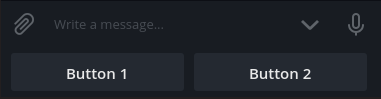
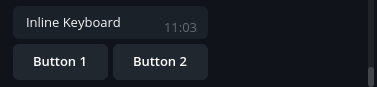
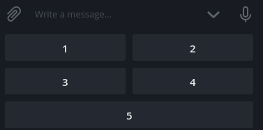
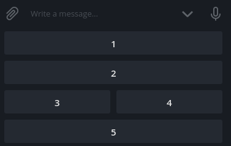
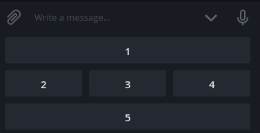
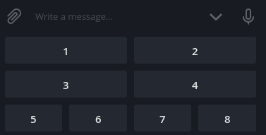

# Telegram Keyboard Builder
Simple and powerful reply and inline keyboard builder for Telegram Bots

## Installation
Just use npm

    npm i telegram-keyboard --save
    
or yarn

    yarn add telegram-keyboard
    
## Example of use in Telegraf

```javascript
const Telegraf = require('telegraf')
const { Keyboard } = require('telegram-keyboard')

const bot = new Telegraf(process.env.BOT_TOKEN)

bon.on('text', async ({ reply }) => {
  const keyboard = Keyboard.make([
    ['Button 1', 'Button 2'], // First row
    ['Button 3', 'Button 4'], // Second row
  ])

  await reply('Simple built-in keyboard', keyboard.reply())
  await reply('Simple inline keyboard', keyboard.inline())
})
```

## Reply (build-in) keyboard

#### Example
```javascript
const { Keyboard } = require('telegram-keyboard')

const keyboard = Keyboard.make(['Button 1', 'Button 2']).reply()

// or using shortcut
const keyboard = Keyboard.reply(['Button 1', 'Button 2'])

console.log(keyboard)
```

#### Result
```JSON
{
  "reply_markup": {
    "resize_keyboard": true,
    "keyboard": [
      [
        "Button 1",
        "Button 2"
      ]
    ]
  }
}
```


## Inline keyboard

#### Example
```javascript
const { Keyboard } = require('telegram-keyboard')

const keyboard = Keyboard.make(['Button 1', 'Button 2']).inline()

// or using shortcut
const keyboard = Keyboard.inline(['Button 1', 'Button 2'])

console.log(keyboard)
```

#### Result
```JSON
{
  "reply_markup": {
    "resize_keyboard": true,
    "inline_keyboard": [
      [
        {
          "text": "Button 1",
          "callback_data": "Button 1"
        },
        {
          "text": "Button 2",
          "callback_data": "Button 2"
        }
      ]
    ]
  }
}
```


## Inline keyboard with custom callback data

#### Example
```javascript
const { Keyboard, Key } = require('telegram-keyboard')

const keyboard = Keyboard.make([
  Key.callback('Button 1', 'action1'),
  Key.callback('Button 2', 'action2'),
]).inline()

console.log(keyboard)
```

#### Result
```JSON
{
  "reply_markup": {
    "resize_keyboard": true,
    "inline_keyboard": [
      [
        {
          "text": "Button 1",
          "callback_data": "action1"
        },
        {
          "text": "Button 2",
          "callback_data": "action2"
        }
      ]
    ]
  }
}
```

## Fixed columns keyboard

#### Example
```javascript
const { Keyboard } = require('telegram-keyboard')

const keyboard = Keyboard.make(['1', '2', '3', '4', '5'], {
  columns: 2,
}).reply()

console.log(keyboard)
```

#### Result
```JSON
{
  "reply_markup": {
    "resize_keyboard": true,
    "keyboard": [
      ["1", "2"],
      ["3", "4"],
      ["5"]
    ]
  }
}
```


## Calculated columns keyboard

#### Example
```javascript
const { Keyboard } = require('telegram-keyboard')

const keyboard = Keyboard.make(['1', '2', '3', '4', '5'], {
  wrap: (row, index, button) => Math.random() > 0.5
}).reply()

console.log(keyboard)
```

#### Result
```JSON
{
  "reply_markup": {
    "resize_keyboard": true,
    "keyboard": [ // different every time
      ["1", "2"],
      ["3"],
      ["4"],
      ["5"]
    ]
  }
}
```
 

## Combine keyboards

#### Example
```javascript
const { Keyboard } = require('telegram-keyboard')

const keyboard1 = Keyboard.make(['1', '2', '3', '4'], {
  columns: 2
})
const keyboard2 = Keyboard.make(['5', '6', '7', '8'])

const keyboard = Keyboard.combine(keyboard1, keyboard2).reply()

console.log(keyboard)
```

#### Result
```JSON
{
  "reply_markup": {
    "resize_keyboard": true,
    "keyboard": [
      ["1", "2"],
      ["3", "4"],
      ["5", "6", "7", "8"]
    ]
  }
}
```


More examples you may find in [example](https://github.com/RealPeha/telegram-keyboard/tree/master/example)
